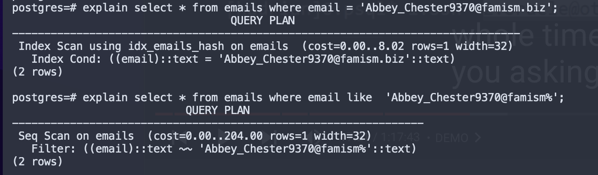
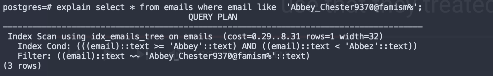

# 15-445 Lecture 08 Notes

**Sequential scan is always the default operation or access method for the database system. 
If they can’t find what it wants using index, it always default using a sequential scan.**

* **Quality predicates**: Hashing index is pretty good
* **Range predicates**: If we know the division of values, then it will choose to do a index leaf scan

**The Buffer-Pool manager doesn't know what's inside the pages, it says you want page 1 2 or 3, here it is, and then whoever is accessing it is responsible to know how to interpret those bytes.**
